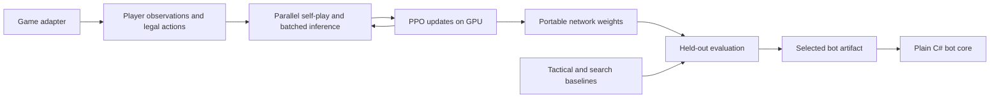

# StratJamAI

An all-C# framework for training and evaluating strategy-game bots under a wall-clock budget. Training uses TorchSharp on an NVIDIA GPU; the exported feed-forward network runs in plain .NET without a native ML runtime.

The included game is **Tic-Tac-Toe**, used to verify the infrastructure. The Strategy Jam rules, game simulator, observation encoding, and event connection still need to be supplied. There is no claim that one hour of training solves an arbitrary game, or that the demo's weights transfer to the event.

## Run it

From the solution directory, with .NET 10 and the NVIDIA driver installed:

```sh
dotnet build StratJamAI.sln -c Release
dotnet test StratJamAI.sln -c Release --no-build
dotnet run --project StratJamAI -c Release --no-build -- doctor --device cuda
dotnet run --project StratJamAI -c Release --no-build -- train --config configs/default.json --output runs/first
```

The default is 60 minutes on CUDA. Package restore and compilation happen **before** the clock starts. The CUDA runtime is included in the TorchSharp package; a separate Python environment is unnecessary. Linux/CachyOS with the RTX 5080 is the verified platform. The project also selects the appropriate TorchSharp package on Windows or macOS, but those platforms have not been tested here.

For a shorter run or CPU training:

```sh
dotnet run --project StratJamAI -c Release --no-build -- train --minutes 5 --output runs/demo
dotnet run --project StratJamAI -c Release --no-build -- train --device cpu --minutes 1 --envs 8 --rollout 256 --batch 64 --output runs/cpu-demo
```

An existing nonempty output directory is never overwritten by a new run. To continue from a checkpoint:

```sh
dotnet run --project StratJamAI -c Release --no-build -- train --resume runs/first
```

Resume uses the original configuration and subtracts already consumed wall time. `--minutes` on resume means the **total cumulative budget**, not additional minutes. Increasing it is an explicit extension. You can also change `--device` or `--workers`; other settings require a new run. Environment episodes and partially collected rollouts restart; checkpointed weights, Adam state, random-generator states, opponent snapshots, and counters are restored. GPU runs are not promised to be bit-for-bit reproducible.

```sh
dotnet run --project StratJamAI -c Release --no-build -- evaluate --model runs/first/best.bot.json --pairs 64 --seconds 120 --output runs/first/audit.json
dotnet run --project StratJamAI -c Release --no-build -- export --run runs/first --output runs/first/bot.json
dotnet run --project StratJamAI -c Release --no-build -- export --run runs/first --output runs/first/network.json --policy-only
dotnet run --project StratJamAI -c Release --no-build -- play-demo --model runs/first/bot.json --human
```

`play-demo` without `--human` runs the exported bot as O against a random X. `benchmark` measures simulator throughput and selects a CPU worker count. `doctor` runs forward/backward computation on the requested device and checks portable inference parity. CUDA failure produces an error; CPU mode is an explicit choice.

## Components

| Project | Responsibility |
| --- | --- |
| `StratJamAI.Core` | Game contracts, demo, managed inference, bots, PUCT search, evaluation, artifact format |
| `StratJamAI` | CLI, TorchSharp model and PPO, parallel rollouts, training supervisor, checkpoints |
| `StratJamAI.Tests` | Algorithm, game-contract, export, checkpoint, and process-level budget tests |



The network has two shared 128-unit ReLU layers. Each legal action is represented by a feature vector; a 64-unit action head scores the concatenation of that vector and the state embedding. A separate scalar head estimates the acting player's return. This allows a different number of legal actions in each state without a hard-coded action vocabulary. Dimensions and feature meanings remain fixed within a versioned game schema.

Exported policies choose the highest-scoring action in sequential, fully observed games. They sample the learned distribution by default in simultaneous or partially observed games, where a predictable pure strategy can be exploitable. The artifact's optional `samplePolicy` setting overrides that default. Each evaluated player has an independent random stream, so one bot's search cannot change its opponent's randomness.

PPO defaults: 64 environments, 8,192 learner decisions per rollout, four epochs, minibatches of 512, Adam at `3e-4`, gamma `0.99`, lambda `0.95`, ratio clipping `0.2`, entropy weight `0.01`, value weight `0.5`, gradient clipping `0.5`, and a KL stop threshold of `0.02`. All are configurable through JSON. Padding is masked both when sampling and when recomputing log probabilities. GAE discounts by elapsed simulator steps; lambda applies per learner decision. True terminal states do not bootstrap; time limits bootstrap the final visible observation and end the episode's trace.

Each match has one learner seat, rotated between episodes. Opponents are approximately 20% random, 30% tactical when available, and 50% recent frozen policy snapshots. One opponent policy is chosen per match. At most four snapshots are retained by default. Rollout inference is batched on the training device; independent CPU game instances advance in parallel. Weights remain fixed during rollout collection. Optional tactical imitation precedes PPO and is never mislabeled as on-policy experience.

PUCT search is available only for deterministic, sequential, fully observable, two-player zero-sum games with a clonable simulator. It uses actual player identities during backup, including extra turns. Search is bounded by simulations, depth, and a per-move deadline. A legal fallback is selected before search starts. An interrupted simulation is not backed up as a draw. The model's policy and value can guide search, but the final selection also evaluates search without the learned model.

## Time, evaluation, and artifacts

| Portion of a 60-minute run | Work |
| --- | --- |
| First 2 minutes | Device/adapter checks, throughput calibration, initial-policy evaluation |
| Through minute 5 | Optional tactical imitation, capped at 128 updates by default |
| Through minute 55 | PPO, periodic policy evaluation, opponent snapshots, checkpoints |
| Through minute 59 | Compare the incumbent, policy candidates, random/tactical bots, and eligible search bots |
| Remaining minute | Final checkpoint, export, and report |

These phase boundaries scale with the total budget; unused optional preparation time goes to PPO. Very short budgets can expire during startup. The parent supervises a separate worker, records consumed time, and kills that worker if it exceeds the overall deadline. Exit code `124` means the watchdog stopped the worker; `130` means interruption. Existing atomic artifacts remain usable. Adapter operations should be fast and bounded; the watchdog is the backstop for a stalled native call or simulator.

Evaluation uses separate seeds from training, all player positions, and a fixed suite of available random, tactical, and exact-oracle opponents. Scores map adapter returns from `[-1, 1]` into `[0, 1]`; in Tic-Tac-Toe this is win = 1, draw = 0.5, loss = 0. Reports include opponent-specific means, move latency, and an approximate 95% bootstrap interval over seat-balanced groups. The highest complete mean score wins; ties retain the incumbent. An incomplete match or suite is never treated as a draw or used to promote a bot. The exact minimax opponent is used for evaluation only.

Files in each run:

| File | Meaning |
| --- | --- |
| `best.bot.json` | Selected complete bot, including its kind and search settings; initially a legal baseline |
| `best-policy.bot.json` | Strongest evaluated neural-network candidate, without search |
| `latest.bot.json` | Latest training network, which may be weaker than the best candidate |
| `config.json`, `doctor.json` | Effective settings and actual device/parity check |
| `metrics.jsonl`, `progress.json` | Training losses, entropy, KL, throughput, process memory, episode statistics |
| `initial-policy.evaluation.json`, `policy-evaluations.json` | Initial and periodic learned-policy results |
| `final-evaluations.json`, `report.json` | Final candidate comparison and run summary |
| `supervisor.json` | Parent status and charged wall time, including evaluation and export |
| `checkpoint.json`, `checkpoints/` | Atomic generation pointer and two checksummed resumable generations |

A checkpoint is committed only after its model/configuration data and Adam state are written. If the newest generation is damaged, loading falls back to the preceding intact generation. Files inside unfinished checkpoint directories are ignored. Export files are also replaced atomically.

`BufferMemoryMiB` bounds stored rollout data and rejects padded tensor batches whose estimated working storage exceeds that amount. It is not a cap on the CUDA context, native allocator, or total process RSS. Reduce `environments` or `minibatchSize` if a game's action lists are large. No legal actions are silently discarded to fit a buffer.

## Add the event game later

1. Implement `IGameDefinition` and `IGameAdapter`, then register the definition in `GameRegistry.Get`. The registry is the only game-specific selection point in the CLI/trainer.
2. Give the adapter a stable `GameSpec.Id` and a versioned `FeatureSchema`. Supply fixed-length, finite, normalized observation/action features. Version rules/reward changes in the game ID or schema, and change the schema whenever feature meanings, scaling, or action interpretation change.
3. `Reset(seed)` initializes a reproducible independent match. `Frame.Decisions` identifies every currently acting player. `Step(jointActions)` applies all supplied actions together. Every request's IDs must be unique and legal for that frame; include an explicit pass/no-op when required.
4. `Observe(player)` must contain only information available to that player. It must work between their turns and at truncation, for value bootstrapping. The adapter owns any observation-history encoding. Do not pass simulator secrets to a policy in a partially observed game.
5. `Frame.Rewards[player]` is the immediate reward from the last simulator transition, including transitions made by opponents. `Returns[player]` is the normalized final match utility in `[-1, 1]` used for evaluation. Set exactly one of `Terminated` or `Truncated` at an episode boundary and expose no action requests afterward.
6. Requests are snapshots: do not mutate their arrays before the next `Step`. The rollout collector makes an owned copy before advancing the simulator. Each worker needs an independent environment and random state; game factories and teacher factories must be safe to call from multiple workers.
7. Optionally provide an observation-respecting tactical teacher and independent evaluation oracle. Only implement `ISearchableGame.Fork` if the declared search capabilities are true. A fork must preserve the exact state and be independently mutable.
8. Add a separate event transport that converts official inputs into these requests and converts returned action IDs into official commands. Configure the actual move limit and validate the simulator against official examples before training.

To use an artifact in a bot host, reference **only** `StratJamAI.Core`:

```csharp
var game = GameRegistry.Get("tic-tac-toe"); // Replace with the event definition.
var artifact = BotArtifact.Load("bot.json", game.Spec);
IBot bot = artifact.CreateBot(game);

int actionId = bot.ChooseAction(request,
    new BotContext(random, Deadline.After(TimeSpan.FromMilliseconds(50)), searchableState));
```

The host must keep action IDs mapped to the current request and provide `searchableState` only where full-information search is supported. The artifact's selected tactical/search bot also requires that game's C# implementation. Native TorchSharp files are not needed by this host.

Continuous-action games, pixel-only observations, learned recurrent memory, hidden-information search, and the event wire protocol are outside this first version. The current feed-forward model and adapter contracts deliberately leave those game-specific choices for the rules release.

## Validation

```sh
dotnet test StratJamAI.sln -c Release
```

Tests include a contextual bandit learned by PPO without demonstrations or search; inference parity and padding masks; terminal/truncated GAE; rewards on opponent turns; simultaneous-player privacy; extra-turn search; checkpoint/Adam continuation and corruption recovery; and subprocess budget enforcement. The GPU `doctor` check is separate from the CPU test suite.

See [validation results](docs/validation.md) for the measured local demonstration run.

Algorithm references: [PPO](https://arxiv.org/abs/1707.06347), [invalid-action masking](https://arxiv.org/abs/2006.14171), and [TorchSharp memory management](https://github.com/dotnet/TorchSharp/wiki/Memory-Management).
